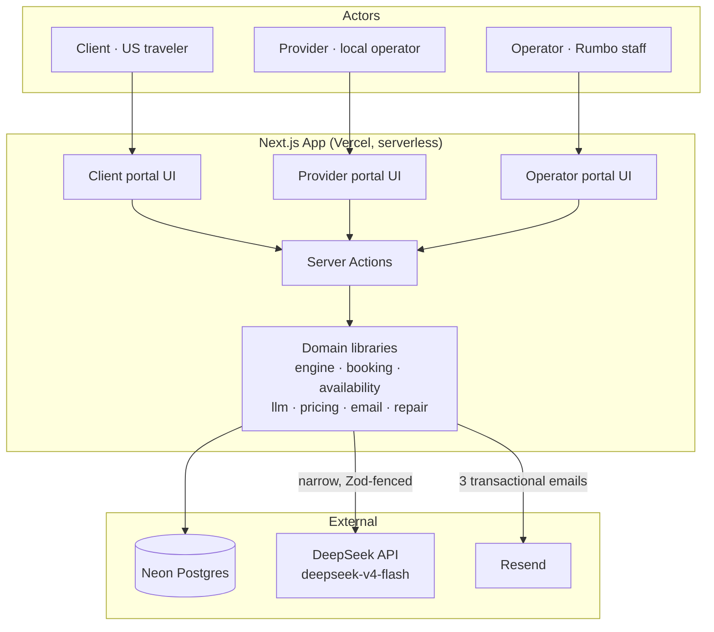
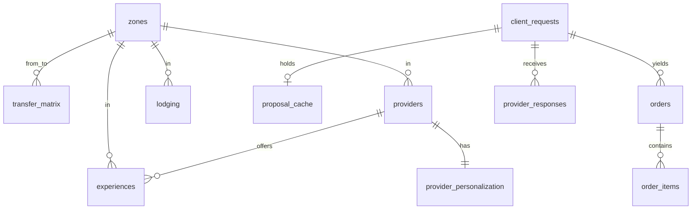
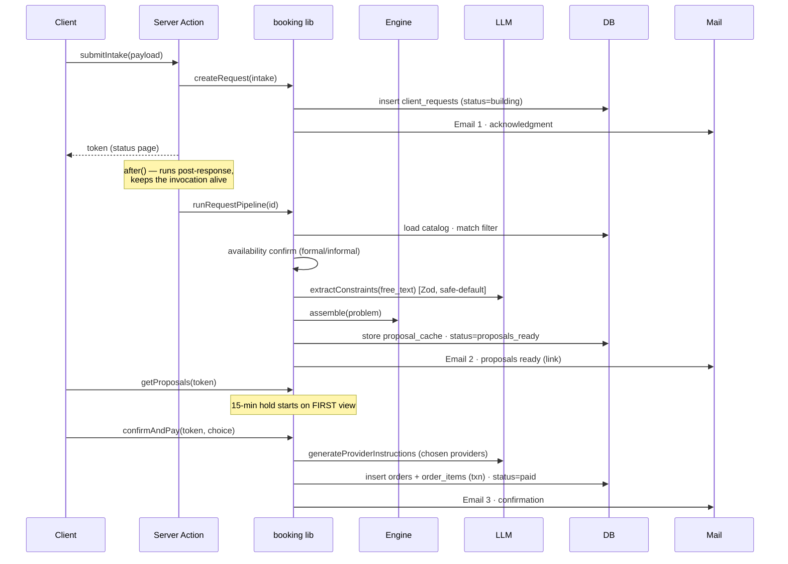

# Rumbo — Software Architecture Document

> **Status:** Assurance-phase document (as-built). Describes the system as implemented across SBI-01…14 plus post-build fixes. Companion documents: [README.md](README.md) (product framing, how to run) and [ADR.md](ADR.md) (the "why" behind each major decision). Where this document states a rule, the authoritative source is the code path named in the same sentence.

---

## 1. Purpose & scope

Rumbo is the internal coordination system of an invented boutique inbound tour operator in El Salvador. It takes a single client request (dates, travelers, budget, preferences, and one free-text description) and produces **three complete, distinct, valid, optimized multi-day itineraries** — activities, local transfers, meals, and lodging — from which the client selects one and completes a simulated payment.

The architectural thesis is deliberate and load-bearing:

> **The core is a temporal constraint-satisfaction + weighted-optimization engine written in application code — not an LLM prompt.** Deterministic code has final say over validity, pricing, availability, and scoring. The LLM occupies a narrow, Zod-fenced boundary that can never influence selection or price.

This document describes the components, data model, engine, request lifecycle, cross-cutting concerns, deployment topology, and the non-functional posture (including what is deliberately out of scope).

### 1.1 Quality drivers (in priority order)

1. **Correctness & determinism** — the same inputs always yield the same itineraries; validity and pricing are provable, not probabilistic.
2. **Separation of concerns** — the LLM cannot leak into money or feasibility; provider net rates cannot leak into client-facing surfaces.
3. **Demonstrability** — a portfolio artifact: the business logic must be legible and the three portals must tell the story end to end.
4. **Cost** — runs entirely on free tiers (Vercel Hobby, Neon free).

Scalability, concurrency, and high availability are **explicitly not** quality drivers (see §11 and ADR-10).

---

## 2. Context & container view



**Container notes**

- One Next.js App-Router application (TypeScript strict) contains all three portals and all domain logic. There is no separate backend service; Server Actions are the RPC surface, and the domain libraries under `project/src/lib` are the "backend."
- Neon (managed Postgres) is the only persistent store. Availability occupancy is **computed**, not stored (§7).
- DeepSeek and Resend are optional at runtime: the system **fails safe** without either (deterministic defaults; no-op email).

---

## 3. Component inventory

| Component | Location (`project/src/`) | Responsibility |
|---|---|---|
| Data model / migrations | `lib/db` | `schema.sql`, migration runner (`migrate.ts`), shared Neon `Pool` singleton (`pool.ts`) |
| Shared types | `lib/types` | TS types spanning engine, booking, portals |
| Seed dataset | `seed` | Schema-conformant catalog (zones, providers, experiences, lodging, transfer matrix, personalization) |
| Availability | `lib/availability` | Deterministic background-occupancy function, confirmation resolution (formal/informal), FNV-1a hash utilities |
| Engine | `lib/engine` | Temporal CSP validity + 5-metric weighted scoring; `assemble()` and `repair()` |
| LLM boundary | `lib/llm` | Deterministic weight derivation (`weights.ts`), Zod-validated free-text extraction, provider-instruction personalization, safe-default fallbacks |
| Pricing | `lib/pricing` | `MARKUP_RATE`, `applyMarkup()` — single source of truth for client price |
| Booking | `lib/booking` | Request lifecycle, proposal cache/hold, order materialization, presentation enrichment (`enrich.ts`) |
| Email | `lib/email` | 3 transactional templates + Resend client, wired into booking lifecycle |
| Provider service | `lib/provider` | Inbox (request × experience matching), response recording, net-rate-only exposure |
| Operator service | `lib/operator` | Read-only dashboard aggregates, repair-demo order listing |
| Repair | `lib/repair` | Reliability-weighted disruption generator, repair invocation against `engine.repair()` |
| Config | `lib/config` | `MAX_TRIP_SPAN_DAYS` and trip-span helpers (client- and server-safe) |
| Client portal (UI) | `app/{page,proposals,status}` | Landing + photo hero, intake, status polling, proposals + booking, confirmation |
| Provider portal (UI) | `app/provider` | Context selector, inbox, history |
| Operator portal (UI) | `app/operator` | Metrics, recent requests, provider-response panel, repair-demo controls |

---

## 4. Data model

Authoritative DDL: `project/src/lib/db/schema.sql`. Eleven tables in two groups — a **static catalog** and a **transactional** set.



### 4.1 Data dictionary (selected columns)

**Static catalog**

- **`zones`** (`id`, `name`, `region∈{west,central,east}`) — ~10 zones; region is only a label. Geography is modeled at the zone level.
- **`transfer_matrix`** (`from_zone`, `to_zone`, `minutes`, PK both) — dense zone-to-zone travel times; the sole geographic input to the engine.
- **`providers`** (`id`, `name`, `zone_id`, `provider_type∈{formal,informal}`, `confirmation_mode∈{instant,on_request}`, `reliability_score 0–1`, `base_popularity 0–1`) — `reliability_score` drives disruption weighting; `base_popularity` drives background occupancy.
- **`experiences`** (`id`, `provider_id`, `name`, `category∈{nature,food,culture,beach,adventure,coffee}`, `zone_id`, `duration_min`, `open_days` CSV of 3-letter days, `open_from`/`open_to` time, `net_price` **per person**, `capacity_per_slot`, `dependency∈{sunrise_only,tide_dependent,weather_sensitive,NULL}`).
- **`lodging`** (`id`, `name`, `zone_id`, `tier∈{budget,comfort,premium}`, `net_price_per_night`, `capacity`).
- **`provider_personalization`** (`provider_id` PK, `special_occasions`, `dietary_options`, `privacy_options`, `extras_on_request`) — free-text capability answers; input to LLM personalization only, not machine-checkable constraints.

**Transactional**

- **`client_requests`** (`id` uuid, `token` unique, contact + trip fields, `prefs_json` jsonb = dropdown preferences, `free_text`, `status∈{building,proposals_ready,paid,expired}`, `extraction_json` jsonb = persisted LLM `ExtractionOutput`, `created_at`). The `token` is the client's only credential.
- **`proposal_cache`** (`request_id` PK, `token` unique, `proposals_json` = `ItinerarySnapshot[3]`, `first_viewed_at`, `expires_at`, `created_at`) — **ephemeral hold**, not a booking. The 15-minute hold starts on first `getProposals` read (§6). Rows past `expires_at` are treated as expired at read time; no cron cleanup at this scale.
- **`orders`** (`id` uuid, `request_id`, `chosen_itinerary_json`, `client_price`, `status∈{paid,settled}`, `provider_instructions_json` = `OrderProviderInstructions[]`, `created_at`) — written only on a completed (simulated) purchase.
- **`order_items`** (`id` uuid, `order_id`, `item_type∈{experience,lodging}`, `ref_id`, `day_index`, `net_price`, `status∈{booked,disrupted,replaced}`) — one row per lodging-night and per scheduled experience. `status` is the substrate the repair flow mutates.
- **`provider_responses`** (`id` uuid, `request_id`, `experience_id`, `provider_id`, `decision∈{confirmed,declined}`, `net_rate`, `decided_at`, unique `(request_id, experience_id)`) — captured provider-portal state; `net_rate` is the provider net total only, never the client price.

### 4.2 Data-handling invariants

- **Neon returns `date` columns as JS `Date` objects.** Every module reading a `date` column normalizes via a shared `toDateString()` helper (`booking/store.ts`, `provider/store.ts`, `operator/store.ts`). Skipping this silently breaks string-templated date math.
- **Neon returns `numeric` columns as strings.** The engine coerces via an internal `num()` helper; callers building `CandidateExperience` from raw DB rows must be aware.

---

## 5. The engine (assembly + repair)

Location: `lib/engine/index.ts`. Two entry points over one CSP + scoring core; **no LLM, no DB** — pure functions over a supplied candidate pool.

```
assemble(problem) → up to 3 valid, distinct, scored ItinerarySnapshots
repair(problem)   → one re-solved gap day, all other days held fixed
```

### 5.1 Day & chaining model

Continuous bounded time: each day has an operating window; each activity consumes real `duration_min`; pieces are chained with inter-zone transfers from `transfer_matrix`. Lodging is the nightly anchor — days are grouped by zone-block, one base per block, and the base fixes the next day's start point and first transfer.

### 5.2 Validity (hard constraints — binary)

`checkValidity(snapshot, problem)` (exported for testing) enforces: feasible transfers within the day window, operating-hours fit, dependency rules (`sunrise_only`, `tide_dependent`, `weather_sensitive`), and the no-early-mornings preference when the client forbids it. Only valid candidates proceed to scoring.

### 5.3 Scoring (quality — weighted)

Five metrics, each normalized to 0–1, combined by a `ScoringWeights` vector that **must sum to 1**: `transfer_efficiency`, `interest_match`, `pace`, `breathing_room`, `variety`. `TOLERABLE_MAX_TRANSFER_MINUTES = 240` bounds the transfer-efficiency metric. Weights are derived deterministically from client dropdowns (§8), never by the LLM.

### 5.4 Distinctness

The three returned proposals are **deliberately** different: `selectDistinct()` rejects any pair whose Jaccard similarity of shared experiences is ≥ `DISTINCTNESS_MAX_SIMILARITY = 0.6`.

### 5.5 Pricing partition

The engine computes `client_total` via `applyMarkup()` (`MARKUP_RATE = 0.30`); provider net prices exist only inside the engine's working set and are never placed on the client-facing `ItinerarySnapshot` (verified per-SBI). See §9.

### 5.6 Known limitation

On long trips the candidate pool is largely consumed, so any two itineraries share > 60% and `selectDistinct` collapses the result toward a single proposal. Mitigated (not fixed) by the trip-length cap (§11.2).

---

## 6. Request lifecycle (pipeline)



**State machine:** `building → proposals_ready → paid`, with `expired` reachable from `proposals_ready` once a viewed hold lapses.

```
building ──pipeline done──▶ proposals_ready ──pay in window──▶ paid
                                  │
                                  └── hold lapses after view ──▶ expired
```

**Key mechanics**

- **`after()` trigger (post-build fix).** `submitIntake` (`app/actions.ts`) returns the token immediately, then runs `runRequestPipeline(id)` inside `after()` from `next/server`, so the serverless invocation stays alive until the pipeline settles. A bare fire-and-forget promise can be frozen after the response on Vercel.
- **Match filter** (`booking/pipeline.ts`): interests (category), `open_days` overlap with the trip's days-of-week, and a loose `applyMarkup(net_price) ≤ budget` sanity check. Full lodging pool passes through uncut — tier preference is a scoring weight, not a filter.
- **Availability confirmation** is resolved once per experience per request, using arrival date + the experience's `open_from` as the representative slot (§7).
- **Hold semantics:** `getProposals` starts the 15-minute hold only on first call (idempotent thereafter); expiry is evaluated at read time from `expires_at`.
- **Order materialization** is a single DB transaction (`BEGIN/COMMIT/ROLLBACK`) that inserts `orders` + `order_items` and flips `client_requests.status = paid`.
- **Personalization timing (deviation, logged):** provider instructions are generated in `confirmAndPay` for the one chosen itinerary's providers, not for all three proposals upfront (see ADR / task_list).

---

## 7. Availability model

Location: `lib/availability/index.ts`. Two deterministic pieces, no `Math.random()` anywhere — all randomness derives from an FNV-1a `stableHash` seeded by `WORLD_SEED` (default `42`, overridable via `RUMBO_WORLD_SEED`).

- **Background occupancy** — `backgroundOccupancy(experienceId, date, slotStartMinutes, basePopularity, seed?) → [0,1]`. A pure function of provider popularity + day/hour + seed; **computed, never stored** (keeps the DB small and the world reproducible).
- **Confirmation resolution** — `resolveConfirmation(mode, reliability, isAvailable, …) → confirmed | no_capacity | no_response`. Formal/`instant` providers confirm deterministically; informal/`on_request` providers may return `no_response` (then discarded), modeling the real coordination step.
- **Real-order consumption** — `spotsConsumedByRealOrders(experienceId, date)` (`booking/consumption.ts`) sums travelers on paid, non-disrupted `order_items` landing on that calendar date, feeding SBI-04's `effectiveSpots` term so real bookings reduce availability.

---

## 8. LLM boundary

Location: `lib/llm`. Provider: DeepSeek `deepseek-v4-flash`, OpenAI-compatible `/chat/completions` with `response_format: json_object`, key `DEEPSEEK_API_KEY`.

**Scope — the LLM does exactly two things, both additive and both fenced by Zod:**

1. **Constraint extraction** (`extraction.ts`): `extractConstraints(freeText, context) → { extra_hard_constraints: {type: dietary|mobility, value}[], personalization_notes: string[] }`. Fails safe to `SAFE_DEFAULT_EXTRACTION` on any error (missing key, network, non-200, non-JSON, Zod failure).
2. **Personalization** (`personalization.ts`): `generateProviderInstructions(notes, providerRow) → string[]`, passing the chosen provider's `provider_personalization` row directly in-prompt (no vector store). Falls back to deterministic keyword overlap on any failure; never throws.

**What the LLM never touches:** `ScoringWeights`, price, availability, or selection. Weight derivation is deterministic — `deriveWeights(prefs)` in `weights.ts` picks one of four base profiles (Relaxed / Explorer / Focused / Comfortable) from `pace` + `group_composition`, applies small dropdown nudges, and renormalizes to sum 1.

> **Current no-op:** `extra_hard_constraints` (dietary/mobility) are additive filters by design, but the catalog has no per-item dietary/mobility column to filter against, so nothing is dropped today. Closing this needs new `experiences`/`lodging` columns (§11.1).

---

## 9. The markup partition (business-critical)

`MARKUP_RATE = 0.30`, `applyMarkup()` in `lib/pricing` — the **single source of truth**; the rate is never hardcoded inline elsewhere (the operator margin calc uses `applyMarkup`, not `0.30`).

- The client is quoted one all-in price = provider net × 1.30. Budget is validated against the **marked-up** price, never net.
- Provider-facing surfaces expose **net only**: `provider_responses.net_rate` and the provider portal read net rates; `budget_total` is read solely for the server-side match filter and never leaves the lib layer.
- Client-facing surfaces expose **client price only**: `enrich.ts` deliberately omits `net_total`/`net_price` from the view model, so they cannot reach the proposals page or emails (verified: no `net_price`/`markup` strings in client HTML or email HTML).

This bidirectional partition is an architectural invariant, re-verified at each SBI checkpoint.

---

## 10. The three portals

No authentication exists anywhere in the system — a non-guessable URL token (client) or a plain selector (provider/operator) is the only "auth", appropriate to the simulated scope.

- **Client portal** (`app/{page,proposals,status}`) — the polished surface: marketing `Header`, photographic hero slideshow, 3-step intake, status polling (5-second interval; polling, not WebSockets/SSE — consistent with the $0 serverless posture), proposals comparison + simulated booking, confirmation. Uses the full `globals.css` design system (cobalt + gold).
- **Provider portal** (`app/provider`) — a thin-cobalt-topbar internal tool: an "acting as" selector drives `?provider=<id>`; the inbox matches active requests to the provider's experiences (same coarse rules as the assembly match filter) and shows the **net rate** with confirm/decline, persisted to `provider_responses`. It is a captured-state surface, **not** an engine authority (it does not re-drive assembly).
- **Operator portal** (`app/operator`) — read-only aggregates (active/awaiting/confirmed counts, month margin via `applyMarkup`), recent-requests table, formal/informal provider-response panel, and the manual **repair demo** (Simulate disruption / Repair) — the only place markup/margin is shown.

---

## 11. Non-functional posture & known limitations

### 11.1 Deliberately out of scope (ADR-10 / README)

International flights (context-only constraints), real payment (no Stripe/PCI), real provider comms (simulated via portal), post-sale service, and **scalability/concurrency/HA**. A production deployment would revisit infrastructure, concurrency, and persistence from scratch.

### 11.2 Known limitations carried forward

- **Engine diversity on long trips** — root cause in §5.6; mitigated by `MAX_TRIP_SPAN_DAYS = 5` (`lib/config.ts`), enforced in both the intake form and the authoritative Server Action. Narrow-interest requests can still yield < 3 proposals; the UI renders fewer gracefully. Real fixes: scale the Jaccard threshold by trip length / MMR re-assembly, or grow the catalog, then raise the cap.
- **Dietary/mobility filter is a no-op** — §8; needs catalog columns.
- **Provider responses don't re-drive the engine** — §10; a live re-solve on provider action was left out of scope.
- **Match logic is duplicated** between `booking/pipeline.ts` and `lib/provider` (kept in sync by hand); a shared helper would remove the drift risk.

### 11.3 Cross-cutting concerns

- **Determinism:** all simulated randomness is seeded FNV-1a; the same request reproduces the same world.
- **Error handling / fail-safe:** LLM and email are best-effort and never block or throw into the pipeline; order writes are transactional.
- **Security:** no secrets committed (`.env*` gitignored except the empty `.env.example` template); env-only configuration; the markup partition (§9) is the primary data-confidentiality control.
- **Observability:** none beyond Vercel/Neon dashboards — acceptable at this scope.
- **Email:** three transactional templates (Resend), UTF-8, table-based, brand-consistent; `From` is env-configurable via `EMAIL_FROM` (falls back to Resend's sandbox sender).

---

## 12. Deployment & runtime topology

| Concern | Choice |
|---|---|
| Runtime | Node.js + TypeScript (strict), Next.js App Router |
| Hosting | Vercel (Hobby, $0), serverless; auto-deploys on push to `main` |
| Database | Neon (Postgres, free tier); connection via `DATABASE_URL` |
| LLM / Email | DeepSeek / Resend (both fail-safe if unset) |
| Provisioning order | **GitHub first, then connect Vercel to the repo** (not the reverse) |
| Env vars | `DATABASE_URL`, `DEEPSEEK_API_KEY`, `RESEND_API_KEY`, `APP_BASE_URL`, optional `EMAIL_FROM` |
| Migrations | `npx tsx src/lib/db/migrate.ts` (idempotent `CREATE TABLE IF NOT EXISTS` + explicit `ALTER … IF NOT EXISTS` for post-hoc columns) |
| Seed | `npx tsx src/seed/seed.ts` (truncates + reloads) |

The `.env` fallback loaders (`db/pool.ts`, `email/client.ts`) short-circuit on `VERCEL`/`CI` and carry `turbopackIgnore` on the `path.resolve` call, so the Turbopack file-tracer stays quiet and production reads env directly.

---

## 13. Traceability

- Product framing & run instructions → [README.md](README.md)
- Decision rationale (ADR-01…10) → [ADR.md](ADR.md)
- Per-SBI build notes, deviations, and open issues → `sbi/task_list.md`
- Orchestration / scope contract → `sbi/SBI-00-orchestration.md`
